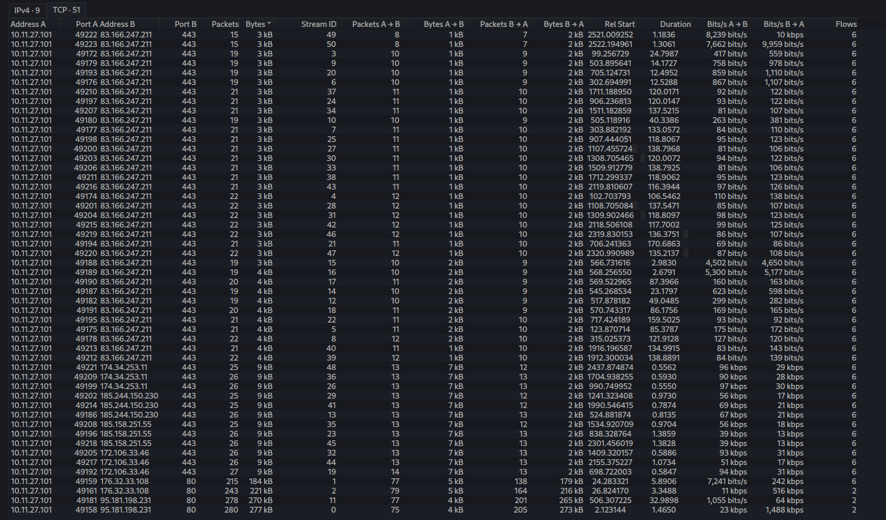
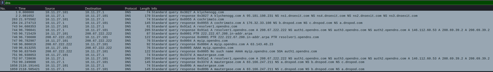
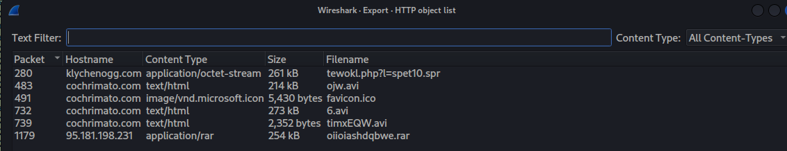
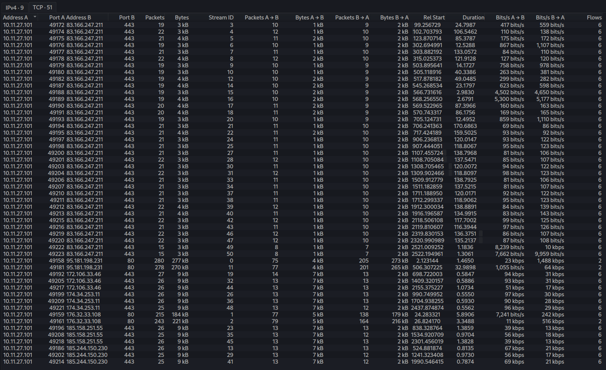
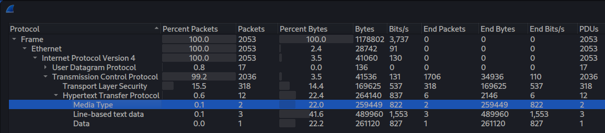
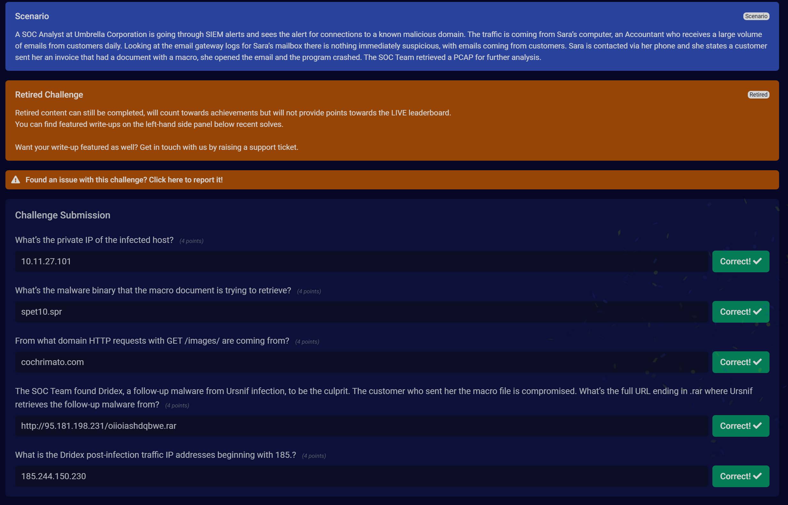

# Ursnif / Dridex Infection - PCAP Analysis

**Platform:** Blue Team Labs Online  
**Category:** Security Operations / Network Forensics  
**Difficulty:** [Easy / Medium / Hard]  
**Date Completed:** 2026-07-03

---

## Scenario

> A SOC Analyst at Umbrella Corporation is going through SIEM alerts and sees the alert for connections to a known malicious domain. The traffic is coming from Sara's computer, an Accountant who receives a large volume of emails from customers daily. Looking at the email gateway logs for Sara's mailbox there is nothing immediately suspicious, with emails coming from customers. Sara is contacted via her phone and she states a customer sent her an invoice that had a document with a macro, she opened the email and the program crashed. The SOC Team retrieved a PCAP for further analysis.

## Objective

Analyze the captured traffic to identify the infected host, the malware retrieved by the malicious macro, and the Ursnif/Dridex post-infection C2 activity.

## Tools Used

- Kali Linux
- Wireshark

---

## Analysis

### Initial Triage

The victim is Sara's host with private IP **10.11.27.101** — the source of all outbound malicious traffic observed in `Statistics > Conversations`.

DNS queries confirm the malicious domains being resolved by the host.

### Malware Binary Retrieved by Macro

Filtering on `http.request` and sorting by time shows the macro reaching out for the follow-up binary. Using `File > Export Objects > HTTP`, the object `tewokl.php?l=spet10.spr` (from klychenogg.com) confirms the retrieved binary: **spet10.spr**.

### Ursnif GET /images/ Domain

In the same HTTP object list, the `GET /images/` requests originate from **cochrimato.com** (serving `.avi`/`.ico` decoy content).

### Ursnif Follow-up (.rar)

The HTTP object list also shows `oiioiashdqbwe.rar` (application/rar, 254 kB) served from **95.181.198.231**, giving the full follow-up URL.

### Dridex Post-Infection Traffic

The 185.x C2 could not be identified from the HTTP objects. Filtering on `tls.handshake.type == 1` surfaced the TLS Client Hello destinations. Two candidates began with 185 (185.158.251.55 and 185.244.150.230); testing confirmed **185.244.150.230** as the Dridex post-infection IP.

---

## Question Walkthrough

**Q1: What's the private IP of the infected host?**  
**Answer:** `10.11.27.101`  
Identified as the source of all outbound malicious traffic in Conversations.

**Q2: What's the malware binary that the macro document is trying to retrieve?**  
**Answer:** `spet10.spr`  
Found via `http.request` sorted by time / HTTP object list (`tewokl.php?l=spet10.spr`).

**Q3: From what domain HTTP requests with GET /images/ are coming from?**  
**Answer:** `cochrimato.com`  
Seen in the same HTTP request stream / Export Objects list.

**Q4: What's the full URL ending in .rar where Ursnif retrieves the follow-up malware from?**  
**Answer:** `http://95.181.198.231/oiioiashdqbwe.rar`  
`oiioiashdqbwe.rar` (application/rar) in the HTTP object list, served from 95.181.198.231.

**Q5: What is the Dridex post-infection traffic IP address beginning with 185.?**  
**Answer:** `185.244.150.230`  
Filtered `tls.handshake.type == 1`, tested the two 185.x Client Hello destinations.

---

## IOCs

| Type | Value |
|------|-------|
| Infected Host | 10.11.27.101 |
| Malware Binary | spet10.spr |
| Domain | klychenogg.com |
| Domain | cochrimato.com |
| Domain | mautergase.com |
| Follow-up URL | http://95.181.198.231/oiioiashdqbwe.rar |
| Dridex C2 IP | 185.244.150.230 |
| Related IP | 95.181.198.231 |

## Analyst Notes

Ursnif (Gozi) banking trojan delivered via a macro-enabled invoice document. The macro pulls `spet10.spr` from klychenogg.com, followed by Ursnif retrieving a `.rar` follow-up payload and pulling decoy `/images/` content from cochrimato.com. Dridex is dropped as the follow-up, establishing encrypted post-infection C2 over TLS to 185.244.150.230.

Relevant MITRE ATT&CK: T1566.001 (Spearphishing Attachment), T1204.002 (User Execution: Malicious File), T1059.005 (VBA macro), T1105 (Ingress Tool Transfer), T1071.001 (Web C2), T1573 (Encrypted Channel).

Defenders should alert on macro-enabled attachments spawning outbound HTTP, HTTP retrieval of `.spr`/`.rar` binaries, and TLS to known Dridex C2 infrastructure.

## Key Takeaways

- Export Objects > HTTP quickly surfaces retrieved payloads and hostnames.
- `tls.handshake.type == 1` isolates C2 destinations when payloads are encrypted and not visible in HTTP objects.
